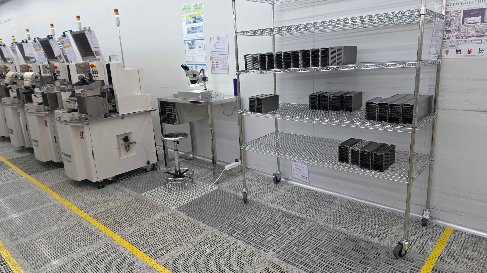

# Fab 사진용 씬 (`--beacon`)

Isaac Sim 기반 촬영용 환경 구성 문서입니다. 실제 반도체 라인 사진을 흉내낸
클린룸 장면으로, **모방학습 데이터셋 수집 씬과 완전히 분리**되어 있습니다.

```bash
./run_mpo700_cr7_isaac.sh --env fab --beacon
```

> `--beacon`을 빼면 데이터셋 수집용 씬(원래 구성) 그대로이며, 아래 내용은 전부
> `if BEACON:` 가드 안에 있어 수집 실행에는 아무 영향이 없습니다.

## 참고 실물 사진

이 씬이 재현하는 실제 라인입니다 (경광봉 달린 wirebonder 줄, 와이어메시 선반의
매거진, 타공 바닥 타일, 노란 통로선).



## 결과물 (Isaac Sim)

`--beacon` 로 렌더한 실제 씬입니다.

라인 전경 — 마주보는 두 줄과 통로:


통로에서 본 뷰 — 선반과 장비 사이의 로봇:


## 장면 구성

좌표계: `x` = 라인 진행 방향(동쪽 +), `y` = 통로 가로 방향, `z` = 높이. 단위 m.

| 요소 | 배치 |
|------|------|
| **Row A (선반쪽 줄)** | wirebonder 원본 1대 + 클론 10대, `x = 2.35 → 13.15` (피치 1.08 m), `y = 0.5`, 정면 −y (통로) |
| **Row B (마주보는 줄)** | wirebonder 10대, `y = −1.40`, yaw 180° 로 Row A 를 마주봄 |
| **통로** | 두 줄 정면 사이 폭 **1.38 m**. 노란선 2줄: `y = 0.10`(선반쪽), `y = −1.04`(맞은편) |
| **로봇** | `(1.5, −0.45)` — 선반(x=0.8)과 첫 장비(x=2.35) 사이, 통로 안 |
| **끝 선반** | 선반라인 동쪽 끝 `x = 14.9`, 높이 0.75배로 낮춤 |
| **경광봉** | wirebonder 마다 상단에 빨강/노랑/초록 신호탑 (`wirebonder_beacon` 에셋) |
| **벽** | 동쪽 `x = 16.5` (끝 선반 뒤), 북쪽 `y = 1.6` (Row A 바로 뒤) |
| **바닥** | 진회색 타공 raised-floor 타일 (`isaac/floor_tile_dark.png`) |

`post_wb` 장비는 이 촬영 씬에서 제외됩니다.

## 재질 / 색상

| 대상 | 색 |
|------|-----|
| 로봇팔 (`Link1~6`) | 아주 진한 회색 |
| 로봇 base / 받침 (`base_link`, `cube_link`) | 크림색, 무광 |
| AGV (`mpo_base_link`) | 주황색 |
| 선반 매거진 (박스) | 면별로 분리 — 윗/아랫면 solid 은회색, 큰 앞뒤면 슬롯 그릴(`isaac/magazine_slots.png`), 양옆 끝면 열림(보드 삽입구) |
| wirebonder 패널 | 상아색 본체 + 진회색 패널 (기본 오버라이드) |

`box_l2a` / `box_l2b`(장비에 파묻혀 있던 박스)는 촬영 씬에서 숨김 처리됩니다.

## 관련 파일

| 파일 | 역할 |
|------|------|
| `isaac/isaac_sim.py` | 씬 빌드. `--beacon` 로직은 전부 `if BEACON:` / `_build_fab_room()` 안 |
| `src/blender/wirebonder_beacon/` | 경광봉 포함 wirebonder 에셋 (기존 `wirebonder/` 와 분리) |
| `isaac/floor_tile_dark.png` | 진회색 타공 바닥 텍스처 |
| `isaac/magazine_slots.png` | 매거진 슬롯 그릴 텍스처 |

## 주요 튜너블 (`isaac/isaac_sim.py`)

- 장비 대수 / 간격 → 클론 루프 `range(1, 11)`, `_PITCH = 1.08`
- 통로 폭 → Row B 의 `y = −1.40`, 노란선 `line_a` 의 `−1.04`
- 로봇 위치 → `ROBOT_XY = (1.5, −0.45)`
- 벽 위치 → `_build_fab_room()` 의 `_x1 = 16.5`, `_y1 = 1.6`
- 끝 선반 → `x = 14.9`, `scale=(1, 1, 0.75)`
- 색상값 → `--beacon` appearance 블록의 각 `_solid_mat(...)`
